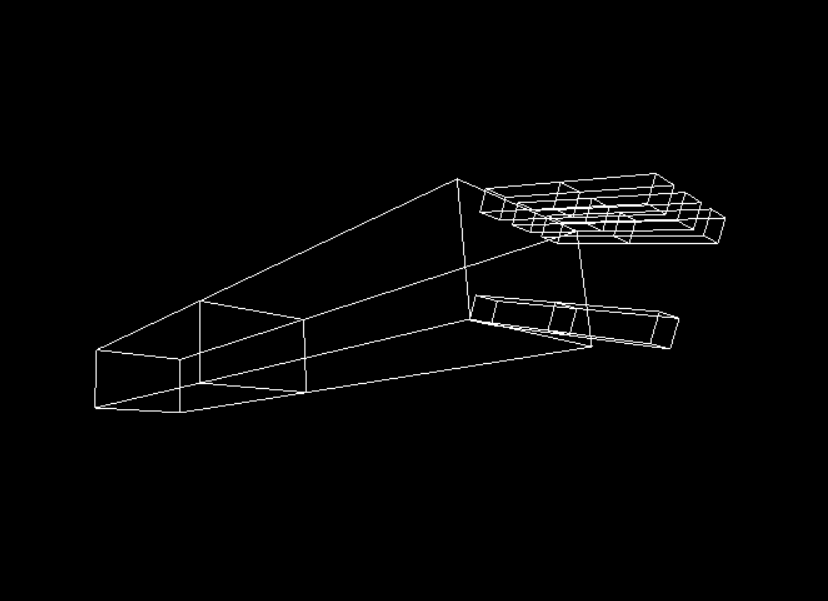
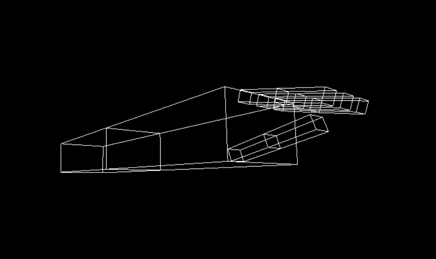
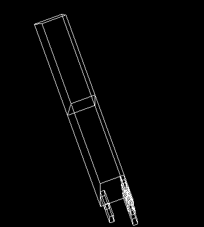
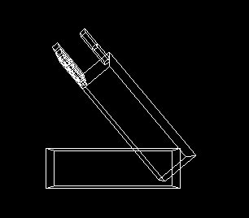
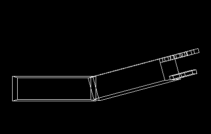
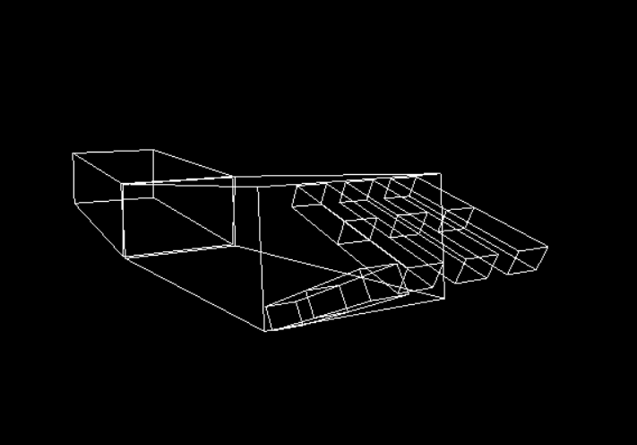
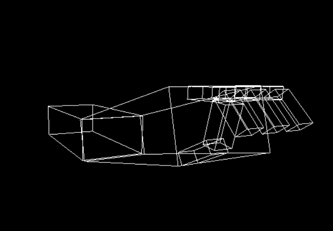

# 3D-Robotic-arm-opengl
This is a robotic arm with shoulders , elbow , fingers  made by opengl
## Making a 3D robotic arms br drawing translated and rotated hierarchical models Using OpenGL.

### **1-Apply transformations to animate the model:**
   * Fixed point rotation is applied on the whole arm.
   * At first there was a problem,I was rotating all the fingers in the same direction but I wanted to rotate the other fingers in opposite direction of the thumb. So, I did it by changing the sign of the rotating angle to inverse the rotating matrix. 

Before | After
  -----|------
   | 

#
### **2-Interaction with the mouse:**
*  You can use the mouse to rotate the hand in all directions & see around it.
### **3-Interaction with keyboard:**

* pressing the 's' and 'S' keys the rotates of the shoulder in and out respectively from -90 to 90 degress.
Shoulder In (Abduction) | Shoulder Out(Adduction)
  ----------|-----------
   | 

* pressing the 'e' and 'E' keys rotates the elbow in and out respectively from 0 to 150 degress.
Elbow In (Flexion) | Elbow Out (Extension)
  -------|---------
   | 

* pressing the 'f' and 'F' keys rotates fingers bases in and out respectively from 0 to 90 degress.
  
* pressing the 'g' and 'G' keys rotates fingers phalanges in and out respectively from 0 to 130 degress.

Fingers Bases In | Fingers phalange In
  ---------------|---------------
   | 
